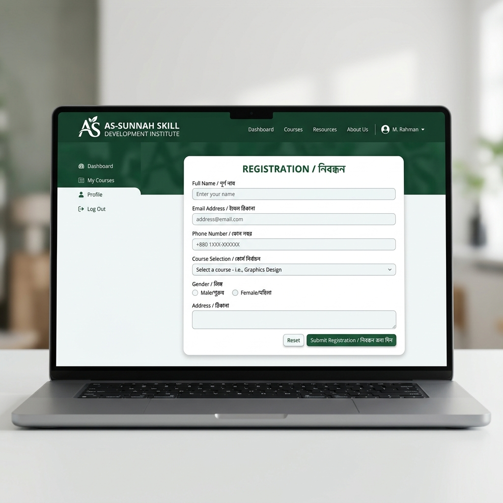

# Admission & Result Checker Web Portal (Google Apps Script)

---

### Developer Profile
*   **Developer Name:** Zihad Hasan
*   **Email Address:** zihad.connects@gmail.com
*   **Note:** This portal was developed to provide a seamless admission and payment validation interface for As-Sunnah Skill Development Institute. For technical support or modifications, please get in touch via email.

---

A beautiful, performant, and responsive web portal built with **Google Apps Script** for handling student result checking, registered candidate payment submission logs, and automated PDF Admit Card generation with email verification.

## Features
1. **Dynamic Navigation Router:** Server-side evaluation shows/hides individual panels or lands onto a multi-utility dashboard depending on admin configuration.
2. **Beautiful Bengali Typography & UI:** Sleek styling tailored with *Noto Sans Bengali*, custom theme schemes, animations, and micro-interactions.
3. **Candidate Verification & Duplicate Lockout:** Ensures only registered candidates can submit payment credentials, and locks users from double-submitting details.
4. **Automated Admit Card Compiler:** Compiles a custom template Doc, turns it into a PDF, links it directly back to the database sheet, and mails it using the Gmail API.
5. **Auto-Rejection Email Dispatcher:** Sends notification emails listing the custom rejection reason to the candidate if marked `Rejected`.

---

## Step-by-Step Installation Guide

Follow these steps to set up the system from scratch:

### Step 1: Create a Google Spreadsheet & Setup Tabs
Create a new Google Spreadsheet and configure four tabs named exactly as follows (case-sensitive):

1. **`Candidate_Master_List`** (Columns A to E)
   * `SerialNumber`
   * `FullName`
   * `RegisteredPhoneNumber` (11-digit string starting with 01)
   * `District`
   * `EmailAddress`

2. **`Payment_Verification_Log`** (Columns A to L)
   * `Timestamp`, `RegisteredPhoneNumber`, `FullName`, `SerialNumber`, `District`, `PaymentMethod`, `PaymentPhoneNumber`, `TransactionID`, `ApprovalStatus`, `ProcessingStatus`, `AdmitCardLink`, `Rejection_Reason`

3. **`Results`** (Columns A to E)
   * `Serial No`, `Phone Number`, `Name`, `Status`, `Message`

4. **`_Configuration`** (Columns A to B)
   * Key-value settings matching properties like `appTitle`, `instituteName`, `logoUrl`, `resultCheckerActive` (`TRUE`/`FALSE`), `paymentFormActive` (`TRUE`/`FALSE`), `statusCheckActive` (`TRUE`/`FALSE`), `paymentOptions` (multiple entries for bkash, Rocket, Nagad), and `instructions`.

*Detailed columns structure is documented in [SETUP.md](file:///SETUP.md).*

---

### Step 2: Configure Google Docs Template & Output Folder
1. Create a Google Doc in your Drive with the layout styled to your choice. Include the visual placeholders shown in [AdmitCardTemplateDemo.md](file:///AdmitCardTemplateDemo.md).
2. Create an empty folder in your Drive where PDF admit cards will be saved.
3. Extract the IDs from both the Google Doc URL and Folder URL.

---

### Step 3: Write Script Code inside Google Apps Script (GAS)
1. On your Google Spreadsheet, click **Extensions > Apps Script**.
2. Rename `Code.gs` or add script files matching the repository files:
   * **[Code.gs](file:///Code.gs)**
   * **[Config.gs](file:///Config.gs)** *(Replace the template IDs, Folder ID, and Spreadsheet ID constants here)*
   * **[PaymentForm.gs](file:///PaymentForm.gs)**
   * **[ResultChecker.gs](file:///ResultChecker.gs)**
3. Create HTML files inside Apps Script:
   * **`Index.html`** (Copy content from [Index.html](file:///Index.html))
   * **`ResultView.html`** (Copy content from [ResultView.html](file:///ResultView.html))
   * **`PaymentView.html`** (Copy content from [PaymentView.html](file:///PaymentView.html))
   * **`StatusCheckView.html`** (Copy content from [StatusCheckView.html](file:///StatusCheckView.html))

---

### Step 4: Install the onEdit Trigger
To automate admit card generation whenever you set a status to `Approved` or `Rejected` on the `Payment_Verification_Log` sheet:
1. In the Apps Script editor interface, click the **Triggers (clock icon)** in the left sidebar.
2. Click **+ Add Trigger** in the bottom right corner.
3. Choose **`handleEditTrigger`** as the function to run.
4. Set event source to **From spreadsheet** and event type to **On edit**.
5. Save the trigger (you will need to approve permissions).

---

### Step 5: Deploy the Web Application
1. Click **Deploy > New deployment** in the top right corner of the Apps Script page.
2. Select **Web app** as the deployment type.
3. Set *Execute as:* **Me (your-email)** and *Who has access:* **Anyone**.
4. Click **Deploy**, authorize permissions, and copy the provided Web App URL.

---

## 📂 Repository File Structure
*   **[Code.gs](file:///Code.gs):** Master router, HTML evaluation and central backend utilities.
*   **[Config.gs](file:///Config.gs):** Centralized constant IDs and configurations.
*   **[PaymentForm.gs](file:///PaymentForm.gs):** Form validations, duplicate checks, manually processing menu, and automated email operations.
*   **[ResultChecker.gs](file:///ResultChecker.gs):** Query backend for student results.
*   **[Index.html](file:///Index.html):** SPA dashboard interface layout, stylesheet core, and front-end logic.
*   **[PaymentView.html](file:///PaymentView.html):** Sub-view for registration checking & payment credential inputs.
*   **[ResultView.html](file:///ResultView.html):** Sub-view for candidate search results.
*   **[StatusCheckView.html](file:///StatusCheckView.html):** Sub-view for verification log query tracking.
*   **[SETUP.md](file:///SETUP.md):** In-depth structural database requirements.
*   **[AdmitCardTemplateDemo.md](file:///AdmitCardTemplateDemo.md):** visual reference template representing placeholders syntax.
